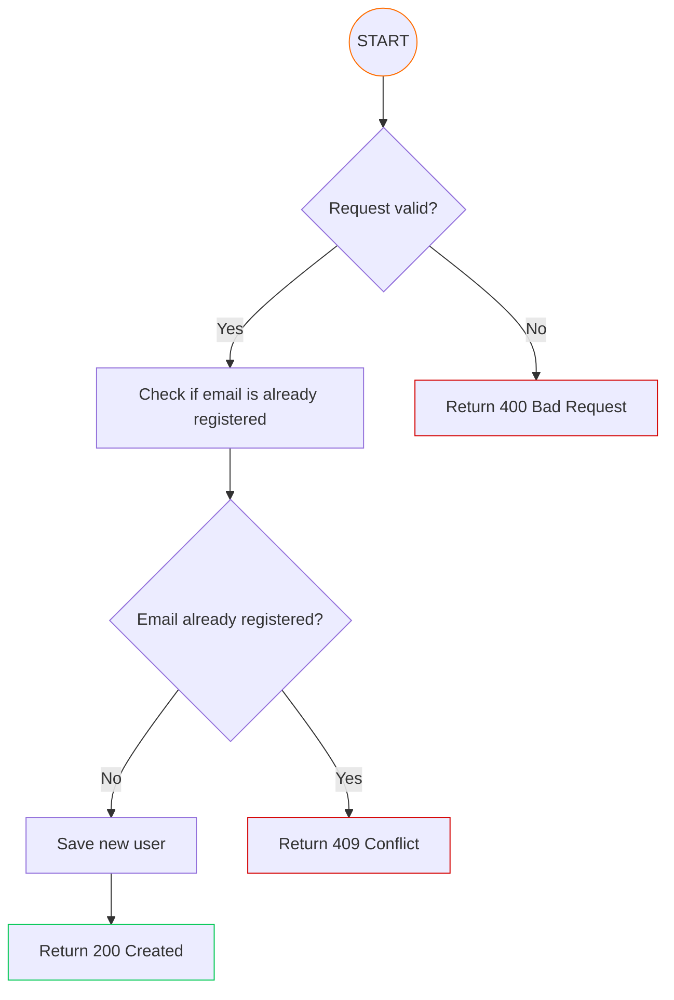
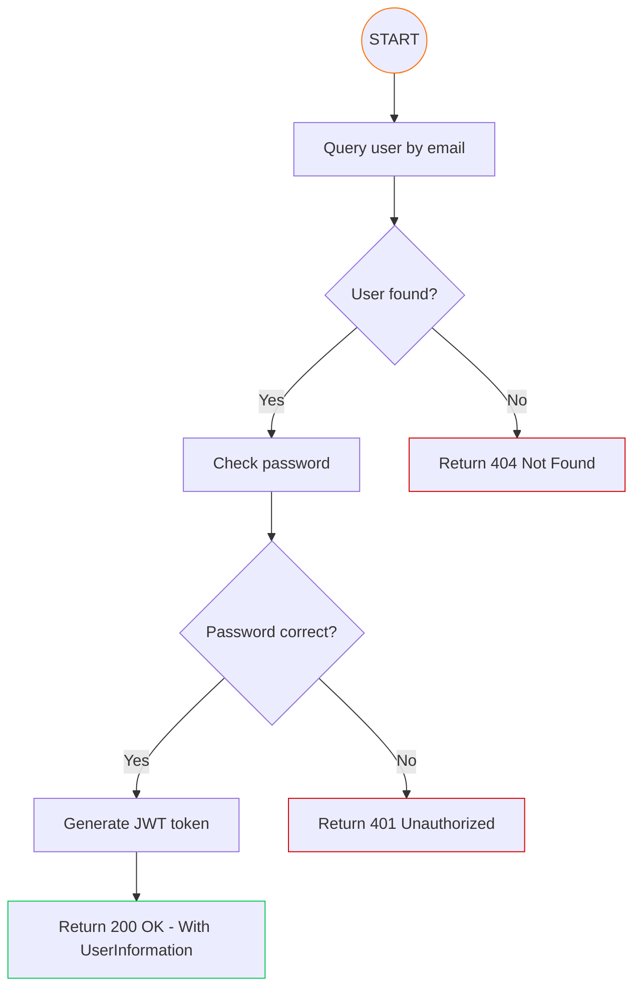

# API-Auth

#### This API will handle all User functions from registration to Roles management and account edition.
#### You can check the OpenAPI documentation [here](https://peralta-cashflow.github.io/CashFlow-API-Auth/).

#### All the authentication process is done by JWT tokens which are generated and sent to front-end when the user logs in. The token will be validated on every request to every API by an interceptor implemented on the [Auth-Lib](https://github.com/Peralta-CashFlow/CashFlow-Libraries/tree/main/Auth-Lib)

# Summary

- [User Registration](#user-registration)
- [User Login](#user-login)
- [Containerization](#containerization)
- [Observability](#observability)
- [Environment Variables](#environment-variables)
- [Sonar Badges](#sonar-badges)

# User Registration

To register a new user, you need to provide the following information:

- **name**: The full name of the user.
- **email**: The email address of the user.
- **password**: The password for the user account.

After this the system will register the account if all the information is correct and return 

#### Flowchart

### User login

To log in a user, you need to provide the following information:

- **email**: The email address of the user.
- **password**: The password for the user account.

After this the system will check if the email and password are correct and return a JWT token if they are. The token
will be used to authenticate the user in all future requests.

#### Flowchart

# Containerization

To run the API in a containerized environment, you can use Docker. Access this [DockerHub](https://hub.docker.com/r/viniciusperalta/cashflow-api-auth)
repository that contains the Docker image for this API, you can pull the image and run it.

If you want, clone this [repository](https://github.com/Peralta-CashFlow/CashFlow-Compose) where we have a 
Docker Compose file that will run all CashFlow environment locally! Checkout the documentation on the repository.

# Observability

This API is configured to expose metrics and traces for observability purposes with [Prometheus](https://prometheus.io/)
also on the Docker Compose file mentioned above, it is integrated with [Grafana](https://grafana.com/). 
Reefer to the Organization's documentation for more details about observability.

# Environment Variables

- DATABASE_CONNECTION_STRING;
- DATABASE_USERNAME;
- DATABASE_PASSWORD;
- APP_CROSS_ORIGIN;
- SERVER_PORT;
- JWT_SECRET;
- JWT_EXPIRATION;

# Sonar Badges

